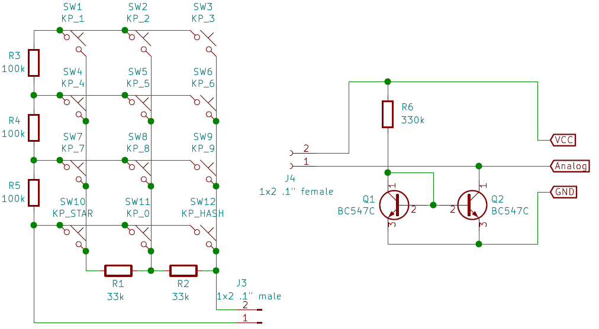

# Analog Keypad Interface

In pin-restricted microcontroller designs it is common to use
analog pins and sets of resistors to encode button switch
inputs to one or few pins. When a larger number of buttons
is used the conventional method of encoding the buttons
by resisitve voltage dividers becomes complex and inaccurate.
Furthermore, such design requires complex algorithm to decode
the button or very accurate resistor selection.

The circuit show in the included schematic and the example
code for Arduino replaces the voltage dividers by
resistance-to-voltage converter implemented using simple
(one resistor and two transistors) current mirror and
simple array of (nRows + nColumns - 2) resistors around
the switch matrix. With suitable, easily analyzed
resistor values the relationship between the measured voltage
and the button index becomes very linear facilitating
easy decoding in SW.

For 3x4 keypad one needs 2 x 33k and 3 x 100k resistors for
the key matrix and a 330k resistor for the reference current.
For 4x4 keypad the corresponding values are 68k, 270k, and 1M,
or alternatively 82k, 330k, and 1.2M. Any pair of close-enough
C-class (beta > 400) small-signal NPN transistors will suffice.
